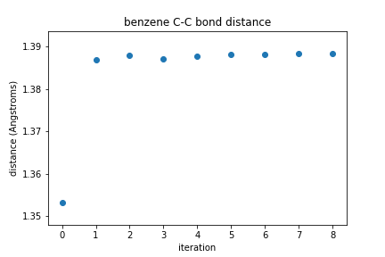
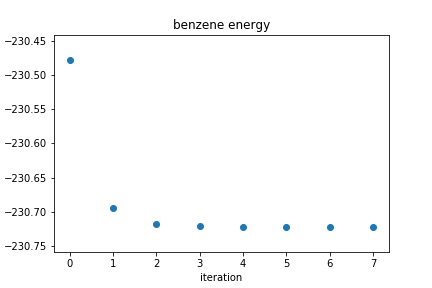
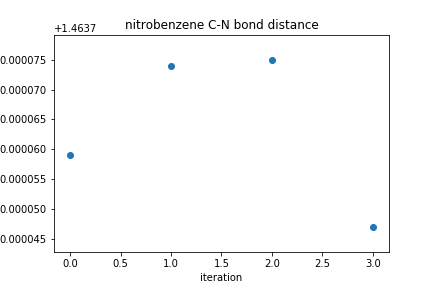
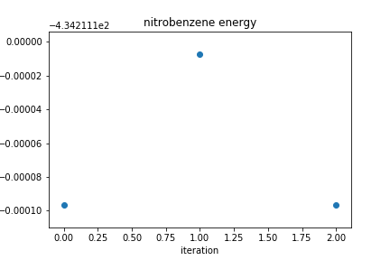

## Overview
In this exercise we use PsiAPI, an implementation of Psi4 within Python, to perform geometry optimization and plot the bond distances and energies for two simple molecules: benzene and nitrobenzene.

> ## Creating a molecule
> To create an initial representation of the benzene and nitrobenzene molecules, we will use the software Avogadro, which is free to [download](https://sourceforge.net/projects/avogadro/files/latest/download). Click to add carbon and right click to delete an atom. Click and drag to add a new atom bonded to an existing atom. Click on a bond to increase the order. More instructions on using Avogadro with pictures can be found [here](https://avogadro.cc/docs/getting-started/introduction/).
{: .callout}

## Basic optimization calculation protocol
At room temperature, most molecules will be in their ground state (i.e., minimum energy state). In terms of molecular structure this means the state where the atoms are arranged such that the total (i.e., nuclear + electronic) energy is lowest. The structure that you get of your molecule from Avogadro has not been optimized using quantum mechanical equations based on the wave functions of all the electrons and is likely far from the ground state. This means that some of the bond distances and angles need to be adjusted before we can perform other quantum mechanical calculations on these molecules. To do this, we choose our basis set and calculate the energy of the initial molecule using the Hartree-Fock method. Then, the atom positions are adjusted to decrease the energy, and the calculation is performed again. To determine how to adjust the atom positions, one strategy is to look for the adjustment that will decrease the energy the most with a small change. This can be thought of like moving in the steepest descent direction on a free energy surface, as shown in the figure. To find the steepest descent direction, a gradient (derivative) of the energy is calculated, and the adjustment is made in the direction of the most negative gradient. Other more advanced optimization methods that converge more quickly and are more accurate include the conjugate gradient method and quasi-Newton methods like BFGS (which use approximations of the Hessian/matrix of second derivatives). This process is repeated until the energy has reached a minimum and the gradient is zero. Now you have an optimized geometry for your molecule!

## Optimizing benzene
To demonstrate a geometry optimization, let's use the PsiAPI to create a benzene molecule.  In this example, we have generated coordinates using Avogadro, but you could generate stating coordinates with any molecular visualization program.

First, import the python packages you will use.
```
# import the python modules that we will use
import psi4
import numpy as np
%matplotlib inline
import matplotlib.pyplot as plt
```
{: .language-python}

Next, we will important two custom functions that have been written for this lesson.  The first function `plot_R` measures the bond distance between two specified atoms at each step of our geometry optimization.  The next function, `plot_energy` extracts the energy at each optimization step.  We will discuss using these functions, and how you can learn about new functions you are provided to use later in this lesson.

```
# function to find the bond distance for two specific atoms in the optimization file
def plot_R(filename, a, b):
    """
    Function to measure the distance between two atoms in a psi4 geometry optimization output file

    Usage: plot_R(filename, a, b)

    Inputs:
    filename: name of psi4 output file from geometry optimization calclaultion
    a and b: atom numbers for two atoms you want to measure the distance between

    Output: list of bond distance at for each optimization step
    """    
    with open(filename) as f:
        pair_notation = 'R(' + str(a) + ',' + str(b) + ')'
        rows_with_R_pairs = [line.split() for line in f if line.find(pair_notation) > 1 and
                             line.strip().split()[1].startswith(pair_notation)]
        bond_distances = []
        bond_distances.append(float(rows_with_R_pairs[0][3]))
        for item in rows_with_R_pairs:
            bond_distances.append(float(item[6]))
        return bond_distances
```
{: .language-python}

```
# function to find the energy in the optimization file
def plot_energy(filename):
    """
    Function to find the energy in a psi4 optimization file.

    Usage: plot_energy(filename)

    Inputs: name of psi4 output file from geometry optimization calclaultion
    filename: name

    Output: list of energy values from each optimization step
    """

    with open(filename) as f:
        #energy_string = 'Current energy'
        energy_values = [ float(line.split()[3]) for line in f if line.strip().startswith('Current energy') ]
        return energy_values
```
{: .language-python}

### Setting up the molecule
First we will set up our molecule as an object in Psi4 using the function `psi4.geometry()`.  Once we have the molecule built, we can use Psi4 to calculate different attributes of the molecule using the basis set that we specify. In this case we will use the Hartree-Fock method (SCF) and the cc-pVDZ basis set. We will calculate the energy of the molecule and print it to a file called 'energy_initial', since this is the initial structure of our molecule. It turns out that this command gives us more than just the molecule's energy.

We can also print the positions of all the atoms at any time using `molecule.print_out_in_angstrom()` and all of the interatomic distances using `molecule.print_distances()`. We will print these to a file called 'geometry_initial' as an example of Psi4's functionality, but we don't really need this information right now.

```
# set the amount of memory that you will need
psi4.set_memory('2 GB')

# set the number of threads (processes) for Psi4 to use
# (~all modern computers can handle 2 threads)
psi4.set_num_threads(2)

# set the molecule name for your files and plots
molecule_name = "benzene"

# enter the charge, multiplicity, and starting coordinates of the atoms in your molecule
benzene = psi4.geometry("""
0 1
   C       -3.98116        3.81771        0.00000
   C       -2.63351        3.75967        0.10838
   C       -2.11978        2.80187       -0.29323
   C       -2.68901        1.83558       -0.80805
   C       -3.92704        1.83138       -0.93484
   C       -4.58021        2.71451       -0.58263
   H       -4.52562        4.63006        0.32966
   H       -2.09025        4.53029        0.52795
   H       -1.09209        2.75239       -0.21305
   H       -2.13621        1.02769       -1.13476
   H       -4.38300        1.01321       -1.36811
   H       -5.60487        2.68217       -0.70124
""")

# Set the name of the output file for the initial energy calculation
# Calculate the initial energy of the molecule using the Hartree-Fock method
# and the cc-pVDZ basis set and print the output to a file
psi4.set_output_file(molecule_name + '_energy_initial.dat', False)
psi4.energy('scf/cc-pVDZ')

# Set the name of the output file to write the geometry information
# Print atomic coordinates and interatomic distances to this file
psi4.set_output_file(molecule_name + '_geometry_initial.dat', False)
benzene.print_out_in_angstrom()
benzene.print_distances()
```
{: .language-python}

### Geometry optimization
Now that we have the molecule setup, we will perform the geometry optimization. The `psi4.optimize()` function performs the optimization, and we need to tell it what method (SCF) and basis set (cc-pVDZ) to use and what molecule to optimize. As the optimization runs, information will be printed to the 'geometry_optimization' file at each step.

**Note:** Although Psi4's default settings should work fine for most reasonable starting geometries, you may need to modify the maximum number of SCF iterations and/or the maximum number of geometry optimization iterations. To modify the maximum number of SCF interations (e.g., to 500), we can do so with `psi4.set_module_options('scf', {'maxiter': 500})`. Similarly, to modify the maximum number of geometry optimization iterations (e.g., to 100), we can do so with `psi4.set_options({'geom_maxiter': 100})`.

After the optimization is complete, we print the atomic coordinates and interatomic distances again, to the 'geometry_final' file.

```
# optimize the molecular geometry
psi4.set_output_file(molecule_name + '_geometry_optimization.dat', False)
psi4.optimize('scf/cc-pVDZ', molecule=benzene)

# print the optimized atomic coordinates and interatomic distances
psi4.set_output_file(molecule_name + '_geometry_final.dat', False)
benzene.print_out_in_angstrom()
benzene.print_distances()
```
{: .language-python}
```
Optimizer: Optimization complete!
```
{: .language-output}

### Reading bond distances from the geometry optimization file
Now we will use the `plot_R` function we imported above to
pull out the bond distances for any two atoms in the molecule from the geometry optimization output file. This way you can look at how the bond distances change during the optimization process.  We won't explain how the function works here, but you can see the information in the 'geometry_optimization' file in the lines that begin with R(a,b), where a and b are the numbers for the two atoms that form a bond.   Remember, we can use the python `help()` function to learn more about how any new function works.

```
help(plot_R)
```
{: .language-python}

```
Help on function plot_R in module __main__:

plot_R(filename, a, b)
    Function to measure the distance between two atoms in a psi4 geometry optimization output file

    Useage: plot_R(filename, a, b)

    Inputs: filename: name of psi4 output file from geometry optimization calclaultion
    a and b: atom numbers for two atoms you want to measure the distance between

    Output: list of bond distance at for each optimization step
```
{: .output}

### Plotting how bond distances change during optimization
Using the function `plot_R`, we will find the bond distances between two atoms at each step of the optimization and store them in the list bond_distances. Then, we will plot how that distance changes at each step of the optimization process. You should see it change from the initial value and then level out to the optimal bond distance based on the Hartree-Fock method and the cc-pVDZ basis set.

```
# find the bond distance for atoms C1 and C2
bond_distances = plot_R('benzene_geometry_optimization.dat',1,2)

# plot the bond distances at each iteration of geometry optimization
plt.plot(bond_distances,'o')
plt.xlabel('iteration')
plt.ylabel('distance (angstroms)')
plt.title(molecule_name + ' C-C bond distance')
plt.show()
```
{: .language-python}



### Plotting how energy changes during optimization
Now we will use the `plot_energy` function from above to extract the molecular energies from the geometry optimization output file. This way you can look at how the energy changes during the optimization process. In the 'geometry_optimization' file you can find this information on lines that begin with **Current energy**.  Then, we will plot how the energy changes at each step of the optimization process. What trend do you expect to see? Why?  In this example, we will also save our plot as a PNG file called `benzene_energy.png`.
```
# find the energies from this optimization file
energy_values = plot_energy('benzene_geometry_optimization.dat')

# plot the energies at each iteration
plt.figure()
plt.plot(energy_values,'o')
plt.xlabel("iteration")
plt.ylabel("energy (Hartrees)")
plt.title(molecule_name + " energy")
plt.show()
plt.savefig(F'benzene_energy.png')
```
{: .language-python}



> ## Exercise: Nitrobenzene
> Using the commands you learned above, perform a geometry optimization for nitrobenzene.  You may wish to make a copy of the notebook you have made so far and change the relevant portions.  You will need to generate coordinates for nitrobenzene using Avogadro or another molecular drawing program.  Plot the distance between the C-N bond as a function of iteration.  Plot the energy of the molecule as a function of iteration.
>
>> ## Solution
>> In the first code block, you need to replace the coordinates of benzene with the coordinates of nitrobenzene and change your molecule name.
>> ~~~
>> # set the amount of memory that you will need
>> psi4.set_memory('2 GB')
>> psi4.set_num_threads(2)
>>
>> # set the molecule name for your files and plots
>> molecule_name = "nitrobenzene"
>>
>> # enter the charge, multiplicity, and starting coordinates of the atoms in your molecule
>> nitrobenzene = psi4.geometry("""
>> 0 1
>>     C           -0.095064772343     0.146295623041     0.059537205186
>>     C            1.283018363291     0.142649668478     0.196784140588
>>     C            1.990331050963    -0.960422939516    -0.254006621934
>>     C            1.318416263743    -2.031528686933    -0.828747057589
>>     C           -0.064188925162    -2.007366882283    -0.956737400211
>>     C           -0.784558755686    -0.910752841459    -0.510319723340
>>     N           -0.848855091435     1.308105436534     0.533445635977
>>     O           -0.233820735922     2.201021978360     1.018562061794
>>     O           -2.029554627386     1.286506572614     0.404620639986
>>     H            1.779858487179     0.986578029758     0.646345969034
>>     H            3.066459468369    -0.982350238052    -0.155873129710
>>     H            1.875676025875    -2.889960105077    -1.178879784359
>>     H           -0.584173157007    -2.842448011438    -1.404447615844
>>     H           -1.857675444135    -0.866918749314    -0.597782154057
>> """)
>>
>> # calculate the initial energy of the molecule using the Hartree-Fock method
>> # and the cc-pVDZ basis set; print this output to a file
>> psi4.set_output_file(molecule_name + '_energy_initial.dat', False)
>> psi4.energy('scf/cc-pVDZ')
>>
>> # print atomic coordinates and interatomic distances to a file
>> psi4.set_output_file(molecule_name + '_geometry_initial.dat', False)
>> nitrobenzene.print_out_in_angstrom()
>> nitrobenzene.print_distances()
>> ~~~
>> {: .language-python}
>>
>> In the geometry optimization block, you may need to change the change the maximum number of SCF iterations using `psi4.set_module_options('scf', {'maxiter': 500})` or the maximum number of geometry iterations using `psi4.set_options({'geom_maxiter': 100})`.  You also need to be sure to change your molecule name in the `psi4.optimize()` command.
>>
>>
>> Once the optimization is complete, you do not need to change anything in the definition of the `plot_R` function, but be sure you execute this code block before you try to use it in the next section!
>>
>>
>> When you use the plot_R function, make sure you correctly specify the atoms you want to measure the distance between.  For the set of coordinates given above, this is atom 1 and atom 7.  Your coordinates may be different!  Be sure to use an appropriate title and axis labels in your plot.
>>
>> ~~~
>> # find the bond distance for atoms C1 and N
>> bond_distances = plot_R(1, 7)
>> # determine an appropriate range for plotting
>> dist_range = max(bond_distances) - min(bond_distances) # check out np.ptp(), too!
>>
>> # plot the bond distances at each iteration of geometry optimization
>> plt.scatter(np.arange(len(bond_distances)), bond_distances)
>> plt.ylim(top = max(bond_distances) + dist_range*0.15,
>>          bottom = min(bond_distances) - dist_range*0.15)
>> plt.xlabel("iteration")
>> plt.ylabel("distance (Angstroms)")
>> plt.title(molecule_name + " C-N bond distance")
>> plt.show()
>> ~~~
>> {: .language-python}
>>
>> For the coordinates used above, the plot of the C-N bond distance looks like this.
>>
>> 
>>
>> For the coordinates used above, the plot of the energy as a function of iteration looks like this.
>>
>> 
>>
>> Your plots may look different or have different numbers of points, depending on how many iterations your geometry took to converge.
>{: .solution}
{: .challenge}



