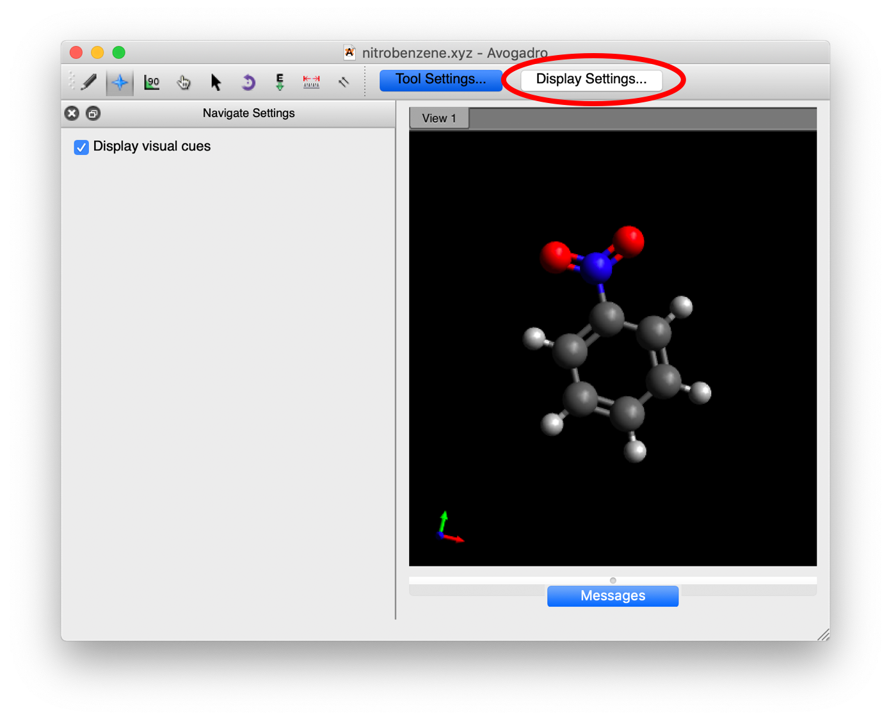
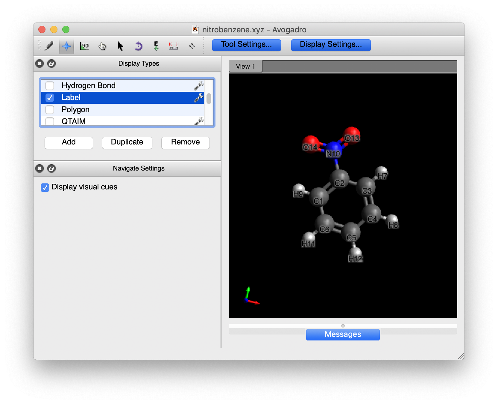
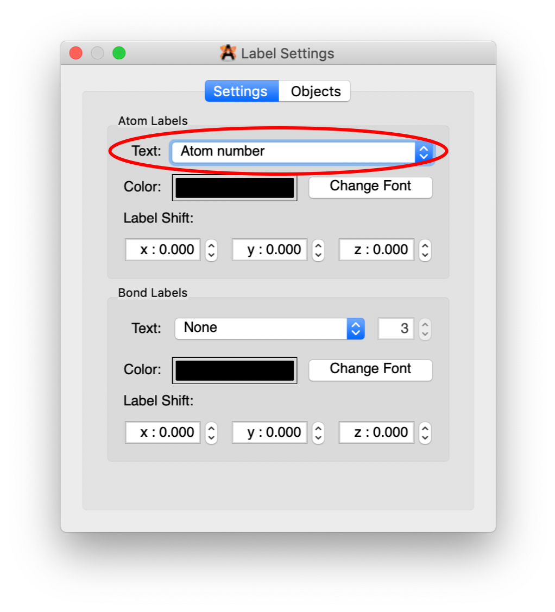
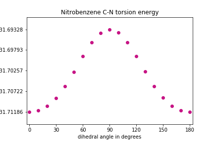
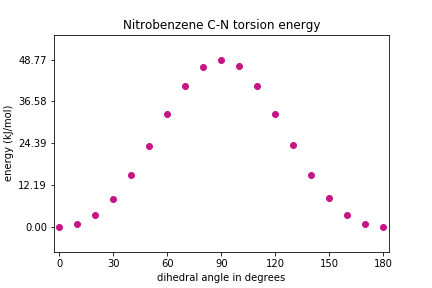

## Overview
In this exercise we create a scan of the rotation of the nitro group in nitrobenzene to obtain a dihedral potential energy plot. These types of plots help us to understand how easily functional groups can change their molecular configuration.

## Initial molecule specification
We will use the optimized nitrobenzene molecule from the geometry optimization lesson.  If you remember, one of the tasks in the last exercise was to print out the final geometry from the optimization into a file names molecule_name_geometry_final.dat where molecule_name was the name of the molecular system we were interested in (benzene or nitrobenzene).  You will need to find and open this file for nitrobenzene to get the coordinates of the optimized structure for this exercise.

## Understanding the internal coordinates of nitrobenzene
Before we can set up the calculations to rotate the nitro group in nitrobenzene, we need to understand which atoms are involved in each internal coordinate for benzene.  One way to do this is to, look at the optimized
molecule in a molecular visualization program like Avogadro.  Most molecular visualization programs use a few standard file formats to specify the geometry of the molecule.  One of the most simple of these file formats is the xyz file.  

The standard format of an xyz file is to have the number of atoms on the first line, a comment line for the second line and then the element name and x, y, and z coordinates (each on separate lines).  An example of this type of file for water would be:
~~~
3
Water geometry
O  0.000 0.000 0.000
H  0.757 0.586 0.000
H -0.757 0.586 0.000
~~~

>## Exercise
>Find the coordinates for your optimized nitrobenzene molecule and use a text editor to create an xyz file for nitrobenzene.
>
>> ## Solution
>> ~~~
>> 14
>> Optimized nitrobenzene geometry
>> C           -0.095064772343     0.146295623041     0.059537205186
>> C            1.283018363291     0.142649668478     0.196784140588
>> C            1.990331050963    -0.960422939516    -0.254006621934
>> C            1.318416263743    -2.031528686933    -0.828747057589
>> C           -0.064188925162    -2.007366882283    -0.956737400211
>> C           -0.784558755686    -0.910752841459    -0.510319723340
>> N           -0.848855091435     1.308105436534     0.533445635977
>> O           -0.233820735922     2.201021978360     1.018562061794
>> O           -2.029554627386     1.286506572614     0.404620639986
>> H            1.779858487179     0.986578029758     0.646345969034
>> H            3.066459468369    -0.982350238052    -0.155873129710
>> H            1.875676025875    -2.889960105077    -1.178879784359
>> H           -0.584173157007    -2.842448011438    -1.404447615844
>> H           -1.857675444135    -0.866918749314    -0.597782154057
>> ~~~
>> {: .output}
> {: .solution}
{: .challenge}

Once you have created your nitrobenzene xyz file, start Avogadro, go to File -> Open.  In the resulting dialogue box, find your nitrobenzene.xyz file and either double click to open it or click on it once and then on the “Open” button in the lower right hand corner of the dialogue box.

With the molecule up in Avogadro, we want to determine which atoms are going to be involved in the torsions.  Remember that what we want to do is rotate the nitro group relative to the benzyl group.  To do this, we want to rotate both of the oxygens out of the plane of the molecule.  So, we will need to determine two dihedral angles that will be equal as we rotate the nitro group.  As discussed in the intro to this section, we are looking for 4 atoms that describe two planes (the first plane is the first three atoms in the list and the second plane is the last three atoms in the list) that have an angle between them.  Try to figure out which atoms should be included in the torsions.  Now, we need to know the number of those atoms to enter into our torsion scan.  To get these numbers, click on the “Display Settings...”  button in the Avogadro window:



This will bring up a window in the left hand side, scroll down until you find the “Label” option and click on the box to the left to make Labels active:



By default, the numbers that you see are associated with each of the elements: C1-C6, H1-H5, N and O1-O2.  We want all of the atom numbers as they were entered into the xyz file.  To get these numbers, click on the wrench to the right of the “Label” line.  A dialogue box will pop up.  Change the option in “Text” to “Atom number”.



Close the dialogue box.  You should now have the molecule with the atom numbers from the xyz file that we will use in developing the potential energy surface (PES) for the rotation of the nitro group.

## Calculating the rotational Potential Energy Surface

Our goal in this exercise is to understand the way the energy of the molecule changes as we rotate the nitro group relative to the benzyl group.  We could just rotate the nitro group a certain number of degrees, calculate an energy, and then repeat as many times as we need to get a decent looking plot.  However, one problem with this is that the bond lengths, and perhaps other angles not associated with the rotation, may actually want to change to get to a lower energy.  The best way to make sure that we are getting the lowest energy associated with the rotation is to rotate the molecule, freeze the dihedrals, and then optimize the geometry - letting all other coordinates change except the frozen dihedrals. This is called a **constrained optimization**.

First we import the python modules we need to use for our calculations.

```
# import the python modules that we will use
import psi4
%matplotlib inline
import matplotlib.pyplot as plt
```
{: .language-python}

### Setting up the molecule and getting the initial energy

The first code block will set up our molecule as an object in Psi4 using the function `psi4.geometry`. You will need to add in the final coordinates of your molecule from the nitrobenzene optimization from the last exercises. As before, we can use Psi4 to calculate different attributes of the molecule using the basis set that we specify. In this case we will use the Hartree-Fock method (SCF) and the cc-pVDZ basis set to calculate the energy of the molecule and store it in a value E for printing in the notebook when the calculation is complete. It is useful to check to make sure that this energy is the same as the one from the final geometry in the optimization - just to make sure that the geometry that you have put in is OK.

We can also print the positions of all the atoms at any time using `molecule.print_out_in_angstrom()` and all of the interatomic distances using `molecule.print_distances()`. We will print these to a file called 'geometry_initial' just as an example, but we don't really need this information right now.

```
# set the amount of memory that you will need
psi4.set_memory('2 GB')

# set several threads to run to get the results a bit faster
psi4.set_num_threads(2)

# set the molecule name for your files and plots
molecule_name = "nitrobenzenepes"

# enter the starting coordinates of the atoms in your molecule
# note that the "0 1" is the charge and multiplicity of the molecule;
# the "symmetry c1" term forces Psi4 to not use molecular symmetry
molecule = psi4.geometry("""
symmetry c1
0 1
         C           -0.095064772343     0.146295623041     0.059537205186
         C            1.283018363291     0.142649668478     0.196784140588
         C            1.990331050963    -0.960422939516    -0.254006621934
         C            1.318416263743    -2.031528686933    -0.828747057589
         C           -0.064188925162    -2.007366882283    -0.956737400211
         C           -0.784558755686    -0.910752841459    -0.510319723340
         N           -0.848855091435     1.308105436534     0.533445635977
         O           -0.233820735922     2.201021978360     1.018562061794
         O           -2.029554627386     1.286506572614     0.404620639986
         H            1.779858487179     0.986578029758     0.646345969034
         H            3.066459468369    -0.982350238052    -0.155873129710
         H            1.875676025875    -2.889960105077    -1.178879784359
         H           -0.584173157007    -2.842448011438    -1.404447615844
         H           -1.857675444135    -0.866918749314    -0.597782154057
""")

# calculate the initial energy of the molecule using the Hartree-Fock method and the cc-pVDZ basis set to a file
psi4.set_output_file(molecule_name + '_energy_initial.dat', False)
E = psi4.energy('scf/cc-pVDZ')

# print atomic coordinates and interatomic distances to a file
psi4.set_output_file(molecule_name + '_geometry_initial.dat', False)
molecule.print_out_in_angstrom()
molecule.print_distances()

#print the energy out to the notebook
print('The energy is: ', E)
```
{: .language-python}

```
The energy is:  -434.2111965383506
```
{: .output}

### Determine the dihedral to be rotated and set up the angles to do the calculation
Now that we have the molecule setup, we need to decide which dihedrals needs to be rotated and then set up an array with the angles that we want to do the calculations.  The definition of a dihedral angle is the angle between two planes.  We know that three points define a plane, so to specify a dihedral angle, you specify *four* atom numbers.  The first three numbers define the first plane and the last three numbers define the second plane.  The two middle numbers are used in both plane definitions.

We want to rotate the nitro group around the plane of benzene.  The first three numbers will be the atoms that form the nitro group: one of the oxygens, the nitrogen, and the carbon the nitrogen is attached to.  The second three numbers will define the plane of the benzene ring: the nitrogen, the carbon the nitrogen is attached to, and an adjacent carbon in the aromatic ring.  There are two oxygens in the nitro group, so we will define two dihedral angles, one based on each, `dihedral1` and `dihedral2`.

> ## Exercise
> Determine the atom numbers for the atoms involved in `dihedral1` and `dihedral2`.  Both dihedrals should be defined such that their initial value is zero.
>
>> ## Solution
>> ~~~
>> # set the dihedrals to be rotated around
>> dihedral1 = "2 1 7 8 "
>> dihedral2 = "6 1 7 9 "
>> ~~~
>> {: .language-python}
> {: .solution}
{: .challenge}

One of the challenges of computations like this is to make sure that the number of calculations is reasonable to give a smooth potential energy plot.  For different molecules, you may have to use a different step size for your angle rotation.  But if you choose too big of a step size, the optimization may fail.  If you take too small of a step, then it will take a long time to generate the calculations.  In this example, we will initially rotate our dihedral angle by increments of 10 degrees.  We will have these values into a numpy array called `phi`.

```
# set the values of the dihedral for the calculations
# note that each value will correspond to a geometry optimization for each of the frozen dihedral values
import numpy as np
phi = np.linspace(start=0, stop=180, num=19)
print(phi)
```
{: .language-python}
```
[  0.  10.  20.  30.  40.  50.  60.  70.  80.  90. 100. 110. 120. 130.
 140. 150. 160. 170. 180.]
```
{: .output}

### Calculating the PES
Now that we have the basics set up, we need to actually run the constrained optimizations for each of the dihedral values. First, we will run each of the optimizations to a separate file and then do a search in each file (like in the first exercise) to get the energy. Then we will plot the energies for each of the dihedral angles involved. One advantage to having the separate files is that you can more easily figure out what is going wrong if you get an error.

This next step is to do the constrained optimizations with different file names for each dihedral value. This will take a bit of time to do the optimization, so be patient! To help speed up the process, we are going to switch the basis set to the 3-21G basis (a smaller basis than the cc-pVDZ one we have used up to this point). You will know all of the computations are complete when you see "All optimizations complete!".

```
# loop over all of the dihedral values
for P in phi:
    #set up a string needed by Psi4 to freeze the dihedral
    frozen_dihedral1 = dihedral1 + " " + str(P)
    frozen_dihedral2 = dihedral2 + " " + str(P)
    print('\nThe value of the frozen_dihedrals is: ', P)
    frozen_dihedral_total = frozen_dihedral1 + " " + frozen_dihedral2
    psi4.set_module_options('optking', {'fixed_dihedral': frozen_dihedral_total})  #set the fixed dihedral
    # we're going to loosen up the convergence criteria to speed this process up
    psi4.set_module_options('optking', {'g_convergence': 'gau_loose'})
    psi4.set_output_file(molecule_name + '_' + str(P) + '_geometry_optimization.dat', False)
    psi4.optimize('scf/3-21G', molecule=molecule)

print('All optimizations complete!')
```
{: .language-python}

```
The value of the frozen_dihedrals is:  0.0
Optimizer: Optimization complete!

The value of the frozen_dihedrals is:  10.0
Optimizer: Optimization complete!

The value of the frozen_dihedrals is:  20.0
Optimizer: Optimization complete!

The value of the frozen_dihedrals is:  30.0
Optimizer: Optimization complete!

The value of the frozen_dihedrals is:  40.0
Optimizer: Optimization complete!

The value of the frozen_dihedrals is:  50.0
Optimizer: Optimization complete!

The value of the frozen_dihedrals is:  60.0
Optimizer: Optimization complete!

The value of the frozen_dihedrals is:  70.0
Optimizer: Optimization complete!

The value of the frozen_dihedrals is:  80.0
Optimizer: Optimization complete!

The value of the frozen_dihedrals is:  90.0
Optimizer: Optimization complete!

The value of the frozen_dihedrals is:  100.0
Optimizer: Optimization complete!

The value of the frozen_dihedrals is:  110.0
Optimizer: Optimization complete!

The value of the frozen_dihedrals is:  120.0
Optimizer: Optimization complete!

The value of the frozen_dihedrals is:  130.0
Optimizer: Optimization complete!

The value of the frozen_dihedrals is:  140.0
Optimizer: Optimization complete!

The value of the frozen_dihedrals is:  150.0
Optimizer: Optimization complete!

The value of the frozen_dihedrals is:  160.0
Optimizer: Optimization complete!

The value of the frozen_dihedrals is:  170.0
Optimizer: Optimization complete!

The value of the frozen_dihedrals is:  180.0
Optimizer: Optimization complete!
All optimizations complete!
```
{: .output}

### Reading energies from the geometry optimization files
Below is a function that will pull out the molecular energies from the geometry optimization output files. This way you can look at how the energy changes as the angle is rotated. In the 'geometry_optimization' file you can find this information where it says 'Final energy : '.
```
# function to find the energy in the optimization files
def plot_pes_energy():
    energy_values = []
    for P in phi:
        with open(molecule_name + '_' + str(P) + '_geometry_optimization.dat') as f:
            final_energy = [ float(line.split()[3]) for line in f if line.strip().startswith('Final energy') ]
            energy_values.append(final_energy[0])
    return energy_values
```
{: .language-python}

### Plotting how energy changes during the potential energy scan

Using the function above, we will find the molecule's energy at each step of the potential energy surface and store them into the `energy_values` variable. We also need to find what the highest and lowest values of the energy are during optimization so that we know what range to use for plotting on the y-axis. Then, we will plot how the energy changes at each value of phi.

```
# find the energies from this optimization file
energy_values = plot_pes_energy()

# determine an appropriate range for plotting
energy_range = max(energy_values) - min(energy_values)

# plot the energies at each iteration
plt.scatter(phi, energy_values, color='MediumVioletRed')
plt.xlim(min(phi)-3, max(phi)+3)
plt.xticks(np.linspace(start=0, stop=180, num=7))
plt.ylim(top = max(energy_values) + energy_range*0.15,
         bottom = min(energy_values) - energy_range*0.15)
plt.yticks(np.linspace(start=min(energy_values), stop=max(energy_values), num=5))
plt.xlabel("dihedral angle in degrees")
plt.ylabel("energy (Hartrees)")
plt.title("Nitrobenzene C-N torsion energy")
plt.show()
```
{: .language-python}



> ## Exercise
> Change the units from Hartrees to kJ/mol and scale the values such that the minimum is at zero.
>
>> ## Solution
>> ~~~
>> # do the unit conversion
>> energy_values_kJ = np.array(energy_values) * (1/3.8088e-4)
>> # and let's define the lowest energy to be zero
>> energy_values_kJ = energy_values_kJ - min(energy_values_kJ)
>>
>> # determine the maximum energy (for setting y axes limits)
>> Emax = max(energy_values_kJ)
>>
>> # plot the energies at each iteration
>> ### note that plt.xticks() and plt.yticks()
>> ### utilize np.linspace() in this solution
>> plt.scatter(phi, energy_values_kJ, color='MediumVioletRed')
>> plt.xlim(min(phi)-3, max(phi)+3)
>> plt.xticks(np.linspace(start=0, stop=180, num=7))
>> plt.ylim(-Emax*0.15, Emax*1.15)
>> plt.yticks(np.linspace(start=0, stop=Emax, num=5))
>> plt.xlabel("dihedral angle in degrees")
>> plt.ylabel("energy (kJ/mol)")
>> plt.title("Nitrobenzene C-N torsion energy")
>> plt.show()
>> ~~~
>> {: .language-python}
>>
>> 
>>
> {: .solution}
{: .challenge}

> ## An alternative to the file parsing technique
> Instead of saving each optimization output file, the PsiAPI allows you to return the output of psi4 function calls directly to numpy objects.  If you wanted to utilize this functionality, in the optimization code block, the output of `psi4.optimize` is now saved to a variable called `E`.  This automatically saves the energy of each step in this variable, making file parsing unnecessary.  
>
> ~~~
> psi4.set_output_file(molecule_name + '_torsionscan_v2.dat', False)
>
> # create empty lists to store phi and energy values
> phi = []
> energy_values = []
>
> # loop over all of the dihedral values
> for P in range(0, 181, 10):
>     #set up a string needed by Psi4 to freeze the dihedral
>     frozen_dihedral1 = dihedral1 + " " + str(P)
>     frozen_dihedral2 = dihedral2 + " " + str(P)
>     print('\nThe value of the frozen_dihedrals is: ', P)
>     frozen_dihedral_total = frozen_dihedral1 + " " + frozen_dihedral2
>     psi4.set_module_options('optking', {'fixed_dihedral': frozen_dihedral_total})  #set the fixed dihedral
>     psi4.set_module_options('optking', {'g_convergence': 'gau_loose'})
>     E = psi4.optimize('scf/3-21G', molecule=molecule)
>     phi.append(P)
>     energy_values.append(E)
>
> print('All optimizations complete!')
> ~~~
> {: .language-python}
>
> Now the `plot_pes_energy` function is not necessary.  The `energy_values` list was created inside the loop as the optimizations were computed and you could now move directly to plotting these values.
{: .callout}
