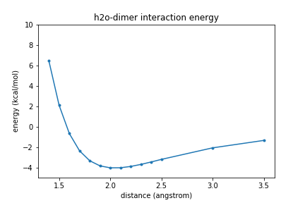

## Overview
In this exercise we will scan the intermolecular potential energy surfaces of a pair of molecules (dimer): the water dimer.

## Loading required modules and functions
```
import psi4
import numpy as np
import sys,os
from math import sqrt,cos,sin,radians
sys.path.append('os.getcwd()')
from copy import deepcopy,copy

import pdb
%matplotlib inline
import matplotlib.pyplot as plt
```
{: .language-python}

## Specifying water dimer geometry
Here you will setup your the potential energy surface scans. The first step is to create your molecule using what is called a z-matrix specification. In this type of geometry specification, you specify the geometry of a molecule through connectivity, that is, by listing each atom and defining its connectivity to other atoms.
```
# set the amount of memory that you will need
psi4.set_memory('500 MB')

# set the molecule name for your files and plots
molecule_name = "h2o-dimer"

# Define water dimer
water_dimer = """
O1
H2 1 1.0
H3 1 1.0 2 104.52
x4 2 1.0 1 90.0 3 180.0
--
O5 2 **R** 4 90.0 1 180.0
H6 5 1.0 2 120.0 4 90.0
H7 5 1.0 2 120.0 4 -90.0
"""
```
{: .language-python}

## Scan 1D PES
Now we will perform a one-dimernsional (1D) scan of the water dimer as the intermolecular distance between the two molecules is increased.  The scan will be performed along the vector connecting the two oxygen atoms of the molecule.  

Since the monomer geometries are not changing and since we don't care about the absolute energy, we will be computing the interaction energy. For a dimer the interaction energy ($E_{\rm int}$) is given by the following equation,

$$E_{\rm int} = E_{ij} - E_{i} - E_{j}$$.

That is, the absolute energy of the two monomers, $E_i$ and $E_j$, are subtracted from the absolute energy of the dimer $E_{ij}$. This is done automatically by using the command `bsse_type='cp'`.

```
rvals = [1.4, 1.5, 1.6, 1.7, 1.8, 1.9, 2.0, 2.1, 2.2, 2.3, 2.4, 2.5, 3.0, 3.5]
energies = []
for r in rvals:
    # Build a new molecule at each separation
    mol = psi4.geometry(water_dimer.replace('**R**', str(r)))

    # Compute the interaction energy
    en = psi4.energy('scf/aug-cc-pVDZ', molecule=mol, bsse_type='cp')

    # Place in a reasonable unit, kcal/mole in this case
    en = en*627.509

    # Append the value to our list
    energies.append(en)

print("Finished computing the potential energy surface!")  
```
{: .language-python}
~~~
Finished computing the potential energy surface!
~~~
{: .output}          

> # Exercise
> Plot the energies vs. the center of mass distance.  
>
>> ## Solution
>> ~~~
>> plt.plot(rvals,energies,".-");
>> plt.xlabel("distance (angstrom)")
>> plt.ylabel("energy (kcal/mol)")
>> plt.ylim(-5, 10)
>> plt.title(molecule_name + " interaction energy")
>>
>> plt.show()
>> ~~~
>> {: .language-python}
>>
>> 
> {: .solution}
{: .challenge}

## Scan 2D PES
Now let's get even more detailed! Instead of simply scanning the PES along a single coordinate, let's consider two coordinates at the same time. For this, we will choose to look at (1) the distance between the two molecules, and (2) a rotation of one of the molecules about the distance vector.

To do this, the first thing we need to do is redefine our z-matrix to define the angle we want to change. To maintain the water molecule as planar, we need to adjust two dihedral angles, such that one angle is always 180 from the other. We will define one of these dihedral angles as A and the other as B.
~~~
# Define water dimer
water_dimer2 = """
O1
H2 1 1.0
H3 1 1.0 2 104.52
x4 2 1.0 1 90.0 3 180.0
--
O5 2 **R** 4 90.0 1 180.0
H6 5 1.0 2 120.0 4 **A**
H7 5 1.0 2 120.0 4 **B**
"""
~~~
{: .language-python}

Since there are now two degrees of freedom, the number of energy evaluations will be increased. To mitigate this, we will scan less frequently along the distance vector from 1.8 angstroms to 2.5 angstroms in 1.0 angstrom increments. At each distance we will also scan along the angle that the second molecule makes with the distance vector, from -180 degrees to 180 degrees in 15 degree increments.  As we calculate the energies at each angle for a particular value of R, we will save the values in a list called `z`.  Once we have finished all the angles for a particular R, we will append the list `z` to a list called `nrg_2D`.  This means `nrg_2D` will be a list of lists.  (We are doing this so we can later recast this to a numpy array.  But that will come later.)  For now, know that an element of `nrg_2D` is a list of all the energies at all the angles for a particular value of R.
~~~
Rvals = [1.8+v*0.1 for v in range(8)]
Avals = [-180+v*15 for v in range(24+1)]

nrg_2D = []

for R in Rvals:

    z = []
    for A in Avals:

        print("computing dimer at %05.2f angstroms and %6.1f degrees"%(R,A))

        # Build a new molecule at each separation
        B = A-180
        molR = water_dimer2.replace('**R**', str(R))
        molA = molR.replace('**A**', str(A))
        molB = molA.replace('**B**', str(B))
        mol = psi4.geometry(molB)

        # calculate energy
        psi4.core.set_output_file(molecule_name + '_%05.2f_%06.1f_energy.dat'%(R,A), False)
        en = psi4.energy('scf/aug-cc-pVDZ', molecule=mol, bsse_type='cp')       
        en = en*627.509
        z.append(en)

    nrg_2D.append(z)

~~~
{: .language-python}
~~~
computing dimer at 01.80 angstroms and -180.0 degrees
computing dimer at 01.80 angstroms and -165.0 degrees
computing dimer at 01.80 angstroms and -150.0 degrees
computing dimer at 01.80 angstroms and -135.0 degrees
computing dimer at 01.80 angstroms and -120.0 degrees
etc.
etc.
~~~
{: .output}

> ## Exercise
> Plot the interaction energies as a function of angle for two different values of R: 2.0 and 2.3.  
>
>> ## Solution
>> In the `Rvals` list, 2.0 angstrom is index 2, `Rvals[2]`.  2.3 angstroms is index 5, `Rvals[5]`.  
>>
>> ~~~
>> # plot energies vs angles at 2.0 angstroms
>> plt.plot(Avals,nrg_2D[2],".-");
>> plt.xlabel("angle (degrees)")
>> plt.ylabel("energy (kcal/mol)")
>> plt.ylim(-5, -2)
>> plt.title(molecule_name + " interaction energy at %4.2f Angstroms"%(Rvals[2]))
>> plt.show()
>> ~~~
>> {: .language-python}
>>
>> Plot goes here.
>>
>> ~~~
>> # plot energies vs angles at 2.3
>> plt.plot(Avals,nrg_2D[5],".-");
>> plt.xlabel("angle (degrees)")
>> plt.ylabel("energy (kcal/mol)")
>> plt.ylim(-5, -2)
>> plt.title(molecule_name + " interaction energy at %4.2f Angstroms"%(Rvals[5]))
>> plt.show()
>> ~~~
>> {: .language-python}
>>
>> Plot goes here.
> {: .solution}
{: .challenge}

## Making 3D plots
Comparing the two graphs you just made, it is clear that the interaction energy is a function of both the seperation between the molecules and the rotation angle.  We can capture this in a 3D plot using some of matplotlib's advanced features.  
~~~
from mpl_toolkits import mplot3d
%matplotlib inline

X, Y = np.meshgrid(Avals, Rvals)

mycmap1 = plt.get_cmap('gist_earth')

fig, (ax,ax2) = plt.subplots(1,2,figsize=(12,6))

ax = plt.axes(projection='3d')
cf = ax.contour3D(X, Y, np.array(nrg_2D), 300, cmap=mycmap1)
ax.plot_surface(X, Y, np.array(nrg_2D), rstride=1, cstride=1, cmap='viridis', edgecolor='none')

ax.set_xlabel('angle (degrees)')
ax.set_ylabel('R (Bohr)')
ax.set_zlabel('energy (kcal/mol)')
#ax.set_zlim3d(-4,-2)
ax.view_init(45, 35)
~~~
{: .language-python}
