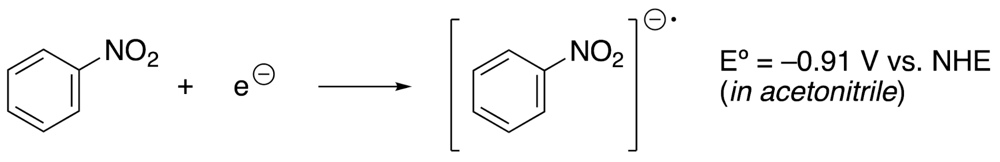
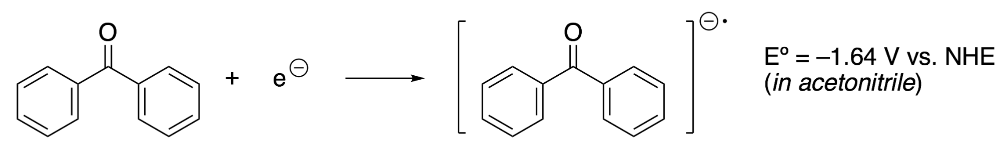
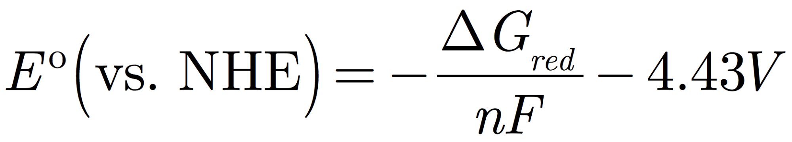

## Overview
One of the most important research problems in chemistry is to find efficient ways to accomplish reactions such as CO2 reduction or water splitting that make chemical fuels from electricity.  If this could be accomplished efficiently and inexpensively, we would be one step further on the way to a renewable energy economy.

The redox potential is a molecular property in chemistry that is very important for renewable energy problems.  It measures the tendency of a species to gain or lose electrons in solution.  In order to apply computational chemistry to renewable energy problems, being able to compute redox potentials for molecular species is incredibly important.  

In order to compute a redox potential, it is important to understand the basic physical principles of this quantity.  For example, take this half-reaction that involves the nitrobenzene molecule:



This redox potential measures the tendency of nitrobenzene to gain an electron to produce nitrobenzene radical anion. More negative values of Eº mean that the species is less likely to gain electrons, or that it requires more energy to reduce. To make a comparison, consider this redox half-reaction that involves acetophenone:



The more negative Eº shows that acetophenone requires more energy to reduce compared to nitrobenzene. Alternatively, acetophenone radical anion would spontaneously transfer an electron to nitrobenzene if they were combined. In this process, the Gibbs free energy of the reaction is obtained by subtracting the redox potentials and multiplying by the number of electrons, in this case, ∆G = –0.73 eV per molecule, or –17 kcal/mol.

Going back to our individual half-reactions, the redox potential is related to the Gibbs free energy of the half reaction as:



Here, Eº is the redox potential corresponding to the quantity that the experiment measures. This is the potential (voltage) of an electrode surface where reactant and product are in equilibrium. More negative potentials correspond to higher energy electrons needed to reduce the reactant.

$$\Delta$$G is the free energy change of the reduction half-reaction in solution, where the electron comes from the vacuum, and the molecules are in solution.  n is the number of electrons transferred (in our case, n = 1) and F is the Faraday constant; its value is exactly 1 eV/V and serves to convert units of energy (in eV) into units of potential (V).

The electrons in the experiment do not come from vacuum, but from an electrode whose potential is measured relative to a reference electrode. We choose to use the normal hydrogen electrode as a reference, where the energy of the electrons is –4.43 V relative to the vacuum, thus we subtract this value from our answer.

Now that we have seen the physical principles, we’d like to obtain  $$ \Delta G_{red} $$ computationally and this would allow us to predict a redox potential. $$ \Delta G_{red} $$  is the Gibbs free energy of reduction, and can be computed as a free energy difference: $$ \Delta G_{red} = G(A^{-}) - G(A)$$ where G(●) is the Gibbs free energy of a species in solution.  Computationally, this is broken down into several contributions:

$$ G = E_{SCF} + \Delta G_{solv} + H - TS $$

The first two terms  $$E_{SCF}$$ and $$\Delta G_{solv}$$ represent the ground-state electronic energy plus the solvation free energy term. These two terms are computed together as the ground-state energy when running a Psi4 energy calculation in implicit solvent. The equilibrium (minimum energy) structure should be used, but you don’t necessarily need to use implicit solvent, or even the same functional or basis set to perform the minimization, as long as you remain consistent for the oxidized and reduced species.

H – TS represent the enthalpy and entropy terms in the Gibbs free energy. We will approximate these terms by treating the molecule as having three translational and three rotational degrees of freedom, and represent all of the internal motions using harmonic oscillators. The translational contributions to H and S come from known formulas for the ideal gas, the rotational contributions use a rigid rotor approximation that takes information from the molecular geometry, and the vibrational contribution requires a harmonic frequency calculation (including the zero point vibration). The frequency analysis calculation in Psi4 provides all of this information.

### Summary of the calculation procedure
In summary, here are the steps for computing the redox potential:
1. For the neutral molecule, follow these steps to compute the Gibbs free energy:
- Calculate an energy minimized structure.
- Calculate the harmonic free energy correction at the energy minimized structure.
- Calculate the ground state energy plus ∆Gsolv from implicit solvent.
(Part (c) may be done at a higher level of theory than (a) and (b)).
- Add the results from (b) and (c) to get the free energy of the species.
2. Repeat the above steps for the anion radical.
3. Calculate ∆Gred = G(A–) – G(A).  This should be a negative number because most molecules in solvent are able to accommodate an additional electron.
4. Convert this energy to eV by multiplying your quantity (in a.u.) by 27.211.
5. Multiply by –1 and subtract 4.43 to obtain the redox potential w/r.t. NHE.

In this exercise, we will study neutral nitrobenzene and the nitrobenzene anion to calculate the redox potential.  

## Part A: Initial molecule specification and optimizations

Import the require python modules.
~~~
import psi4
import numpy as np
~~~
{: .language-python}

Set up the calculation options for the initial energy calculation.
~~~
psi4.set_memory('2 GB')
psi4.set_num_threads(2)

nitrobenz = psi4.geometry("""
symmetry c1
0 1
C       -3.5048225421    0.0711805817    0.1456897967
C       -2.1242069042    0.0676957680    0.1437250554
C       -1.4565144627    1.2657898054    0.0112805274
C       -2.1243502782    2.4616659201   -0.1394727314
C       -3.5049153121    2.4578370923   -0.1457245349
C       -4.1936081427    1.2645153194    0.0001955136
H       -4.0381801262   -0.8505059514    0.2559173303
H       -1.5620288767   -0.8346363876    0.2389155097
H       -1.5619534389    3.3630228735   -0.2428628637
H       -4.0382012347    3.3785626398   -0.2639829256
H       -5.2650389640    1.2641688843   -0.0022762561
N       -0.0085078655    1.2648596634   -0.0056641832
O        0.5639468379    0.1670702678   -0.1297708787
O        0.5668300231    2.3598431617    0.1306822195
""")

psi4.set_output_file('00_initial_energy.dat', False)
psi4.energy('B3LYP/3-21G')
~~~
{: .language-python}

## Part B: Geometry optimization (gas phase)
~~~
psi4.set_output_file('01_geometry_optimization.dat', False)
psi4.set_options({'g_convergence': 'gau_tight'}) # this forces the optimizer to get close to the minimum
psi4.optimize('B3LYP/3-21G', molecule=nitrobenz)
~~~
{: .language-python}

~~~
Optimizer: Optimization complete!
-434.3175493756396
~~~
{: .output}

## Part C: Frequency calculation
~~~
psi4.set_output_file('02_frequency_analysis.dat', False)
b3lyp_321g_energy, b3lyp_321g_wfn = psi4.frequency('B3LYP/3-21G', molecule=nitrobenz, return_wfn=True, dertype='gradient')
~~~
{: .language-python}

~~~
73 displacements needed.
 1 2 3 4 5 6 7 8 9 10 11 12 13 14 15 16 17 18 19 20 21 22 23 24 25 26 27 28 29 30 31 32 33 34 35 36 37 38 39 40 41 42 43 44 45 46 47 48 49 50 51 52 53 54 55 56 57 58 59 60 61 62 63 64 65 66 67 68 69 70 71 72 73
Warning: used thermodynamics relations inappropriate for low-frequency modes: ['80.4447' '182.6292' '260.4532' '405.5899' '441.5085' '457.6620'
 '498.9331']
~~~
{: .output}

We have to define a function called `parse_free_energy` to extract the free energy from the output file.  

~~~
def parse_free_energy(filename):
    """ Parse out the free energy from a Psi4 vibrational analysis output file in a.u. """
    for line in open(filename).readlines():
        if "Correction G" in line:
            return float(line.split()[-2])
~~~
{: .language-python}

```
parse_free_energy('02_frequency_analysis.dat')
```
{: .language-python}
```
0.07134789
```
{: .output}

## Part D: Energy calculation with large basis set + PCM solvent model
~~~
psi4.set_options({
  'pcm': True,
  'pcm_scf_type': 'total',
})

psi4.pcm_helper("""
   Units = Angstrom
   Medium {
   SolverType = CPCM
   Solvent = Acetonitrile
   }
   Cavity {
   RadiiSet = UFF
   Type = GePol
   Scaling = False
   Area = 0.3
   Mode = Implicit
   }
""")

psi4.set_output_file('03_solvent_energy.dat', False)
psi4.energy('B3LYP/heavy-aug-cc-pVDZ', molecule=nitrobenz)
~~~
{: .language-python}
```
-436.8136694695731
```
{: .output}

> ## Exercise: The nitrobenzene anion
> Using the commands you already learned, calculate all the same quantities for the reduced nitrobenzene (-1 charge).  In your molecule specification section, you will need to change your charge and multiplicity to reflect the correct values for the anion.  If you already carried out calculations on the neutral molecule in this notebook, you will need to start a new notebook or click Kernel -> Restart & Clear Output before working on the anion.  For the anion calculations, you need to change the refernce using the command `psi4.set_options({'reference':'UKS'})` which should be placed right before the energy call.  
>
>> ## Solution
>> Your final results should be as follows.
>>
>> | Charge on nitrobenzene | Minimized E (gas) | Free energy correction (gas) | SCF E + Delta G Solvation | Total Gibbs Free Energy |
>> |------------------------|-------------------|------------------------------|---------------------------|-------------------------|
>> | 0 (oxidized)           | -434.317549       | 0.071346                     | -436.813669               | -436.74232254           |
>> | -1 (reduced)           | -434.338874       | 0.068022                     | -436.942923               | -436.874901             |
>> |                        |                   |                              |                           |                         |
>>
>> To calculate E standard
>>
>> ∆Gred = -436.874901+436.74232254 = -0.13257846 a.u. = -3.607645 eV
>>
>> -∆Gred / nF = 3.607645 V
>>
>> Eº = -∆Gred / nF - 4.43 V = -0.82 V
> {: .solution}
{: .challenge}

> ## Further Reading
>You can read more on computation of redox potentials using implicit and explicit solvent models [here](https://doi.org/10.1021/ct200340x).
{: .callout}
