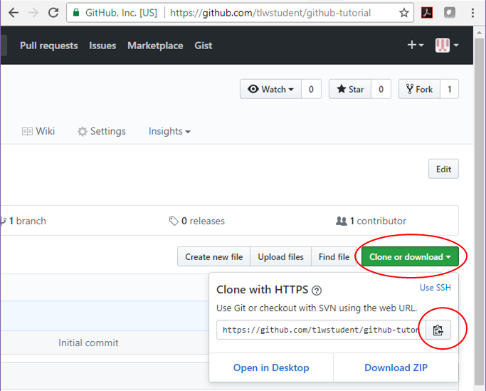

## Overview
In this activity, you will make a GitHub account, clone a working repository, and perform some basic tasks that are common in using GitHub and git as a community repository.  Note that git and GitHub are extremely powerful and only a very small subset of the capabilities are shown in this exercise.

## Making a GitHub account
- In a browser go to https://github.com
- Fill in the blanks for Username, Email and Password (remember the password since you will need it later)
- Choose the “Unlimited public repositories for free” button and click “Continue”
- You can either fill in the survey and click “Continue” or click “Skip this step” (next to the “Continue” button at the bottom of the page)
- You will get an email to verify your email address. Click on the link in the email and log into your account.
- You now have a fully functioning account!  

>## Choosing your GitHub Username
>It is now very common for potential advisors and employers to look at your GitHub page to see what types of projects you have contributed to.  Therefore, you should chooose a GitHub username that is *recognizable* and *professional*, and keep your profile up-to-date.
{: .callout}

## Forking a repository
- Find an existing repository that you want to work on.  Use the repository at https://github.com/twindus/github-tutorial unless your instructor gives you a different repository to use.
- Click on the “Fork” button on the upper right corner of the screen:

- This will create a clone of the repository into your GitHub account and put your active browser page on your repository.  This will allow you to make your own changes to the content of the repository.

## Set your local git repository
So far, you have only interacted with GitHub.  To most effectively make changes in a repository, it is most useful to have a copy (or clone) of the repository on your computer.  

To do this, you will first need to open an appropriate “window” on your computer and set up your git repository:  
- If you are on a Windows machine, go to the Start Menu and start the application “Git Bash” or the “Anaconda Powershell Prompt”, whichever you have available on your machine.
- If you are on a Mac, you should start the “Terminal” application (located in Applications/Utilities).  
Either one of these will open a window where you can type in commands.  For the rest of the exercise, we will call this window the “command window”.

Now we need to configure git so it knows a bit about you.  The first command below is setting your email address and the second one sets your name (this can be anything that you would like it to be, but most people use their real names so that others can tell who is working on a repository).  These particular commands are setting options in a file named .gitconfig in your home directory and will be what is used for ALL of your git repositories.  In the command window, type

```
git config --global user.email you@example.com
git config --global user.name "Your Name"
```

Make sure that you substitute in your actual e-mail for you@example.com and your real name for Your Name.  You will need the quotes around Your Name.

## Make a clone of the repository on your own computer
To clone your repository onto your computer:
- You will need to know the repository address (or remote address) to take the information from.  Go to your repository in GitHub on your browser and click on the green “Clone or download” button.  Once the pop-up window opens, click on the clipboard icon to copy the URL into the clipboard (make sure to grab the URL and not the ssh address):

- Now, go to the command window.  We will make a clone of the repository in GitHub to your local machine.  We will make a folder in your (Desktop) folder to make sure we know where it is. Type:
```
cd (Desktop)
mkdir molssi-day2
cd molssi-day2
git clone <url>
```
where you should substitute the location of your Desktop folder for (Desktop).  Also, <url> should be replaced with the url you obtained in the previous (you can paste it into the command window or type it from the browser window - in the example above the <url> is https://github.com/tlwstudent/github-tutorial)  *Do not use the url to the in the figure!  Use the one for your repository!*
- You should now have a copy of the repository on your computer.  To get into the directory where the files are located, type:
```
cd github-tutorial
```
If you then type:
```
ls
```
into the command window, you will get a list of the files that are in the repository.

It is important here to note that you have not just made a copy of the files onto your local machine, but also into the local git repository on your computer!  So, for a while, we are going to work on your local files and on the local git repository.  Once we have things like we want them in the local git repository, we will make the changes into GitHub.

## Making a change in a file
The next thing we will do is to make some changes in a couple of the files and commit them into the local git repository.  Note that we can make as many changes to the files as we want without any fear of changing the repository until we use a “git” command.  Even then, there are ways (that we won’t go into for this short tutorial) to recover from most commands.  So, have no fear of trying things out!  

- Using a text editor (like Atom, TextWrangler or Notepad++), open up the file text1.txt.
- Make any changes that you like - change words, delete sentences, add text, etc.
- Save and close the file.
- Open up the file text2.txt and again make any changes that you like, save and close the file.

At this point, you have only made changes to your local files, but not to the local git repository.

Now, let’s learn a command that is very useful to get an overall view of what has changed from your files and the local git repository.  Type:
```
git status
```
You will see something similar to the following:


Note that it tells us that we have two files that have been modified.  They have not yet been added into the local repository.  Also note that while git recognizes that text1.txt and text2.txt have been modified, they are “not staged for commit”.   It turns out that we actually have three local areas we need to be concerned about: the local files, the local git repository and a git staging area that we haven’t discussed before.  Think of the staging area as a place where we let git knows which files we are going to commit to the local repository (because we may not want to commit all of the files that we are going to make changes on).  To add these files to the staging area, we type:
```
git add text1.txt text2.txt
git status
```
This should give us:


The two files are now in the staging area and could be committed to the local repository.  But before we do that, let’s add another file.

## Add a files
Let’s say that we decide we want to add another file that has some of our other favorite text in it to share with our fellow students.  So, let’s make another file.

- Open your text editor (if it is not already open), and open a new file.
Put in any text that you would like.
- Save the file as text3.txt and close it.  (Make sure that the file that you created is in the directory with the other local files.)

In the command window, type `git status`.  You should see something like this:


Note that in addition to the two files that we modified and that are in the staging area, we now have an “Untracked file” - text3.txt.  It is untracked because git knows nothing about it!  So, we need to tell git that we want this file to be part of the repository.  To do that, type:
```
git add text3.txt
git status
```
You should see something like:


Note now that text3.txt has been added to the staging area and is ready to be committed.   It has not yet been committed, though.

## Committing changes to the local repository
Now that we have all of the changes and additions that we want into the staging area, we are ready to put those changes into the repository.  This is done by typing:
```
git commit -m “some simple modifications and additions”
```
The text in the quotes can be whatever message that you would like to give.  The message should usually be more descriptive than this one is - the idea is to give you some idea of what the changes were.  Now type “git status” again.  You should see something like:


Note that it says that there is nothing to commit.  It also says, “Your branch is ahead of ‘origin/master’ by 1 commit.”  This is saying that you have made 1 commit to your local repository (a “branch” of your GitHub repository) that is not in your GitHub repository (‘origin/master’).

We could repeat making changes to our files and committing changes to our local repository until we have made all of the changes that we want.  We can do as many “git commit” commands as we need to get the files as we want them.  Once this is done, we are ready to push our changes back up to the GitHub repository.

## Push our changes from our local git repository up to our GitHub account
Type:
```
git push origin master
```
`origin` means the place where the local repository was taken from - our GitHub account in this case -  and `master` means the local branch that we want to push - by default, your local git repository is called master.

This may take a few minutes to run, but should pop up a window to ask you for your GitHub username and password.  When it does this, fill these in and hit “Login”.

You can check to see if your GitHub repository has been updated by going to the browser with your GitHub repository in it and refreshing the browser screen.  You should see the message for the commit on text1.txt and text2.txt, and you should also see the new file text3.txt.

## Requesting your changes be made to the upstream repository (the one you originally forked from)
Your changes are now in your GitHub repository.  However, if you have made changes that you would like to get back into the upstream repository (the one you originally forked from), you will now need to do a pull request.  This is basically notifying the originator of the upstream repository that you would like some changes merged into the upstream repository.  The originator can decide whether or not to include some or all of the changes into the upstream repository.  To start the pull request:

- In your browser, go to the upstream GitHub repository https://github.com/twindus/github-tutorial.   
- Click on the “New pull request” button:

- On the resulting page, click the “compare across forks” link:

- Next, you need to pick your fork to compare against.  So, click on “head fork:” and choose your fork:

- Next click on the green “Create pull request” button:

- On the resulting page, put in a title, some comment about what the pull request is in the comment box and click on the green “Create pull request” button.

- Now it will be up to the originator of the upstream repository to decide whether to merge your code into his/her repository.

>## Time check
>Let your instructor know when you reach this point.  There may be a short break before you proceed.
{: .callout}

## Resolving conflicts with the upstream repository
Often times when you are working in a collaborative project, someone else may change the same files that you are working on.  If their changes get merged into the upstream repository before yours do, this can cause a “merge conflict” in your repository.  In other words, your version is now out of date with changes that have happened in the upstream repository.

To show you how to resolve a conflict, we first have to make a conflict that can’t be merged.  Note that most changes can be merged pretty easily.  However things like changing the same line in the same file or deleting files will create conflicts that will need a bit more attention.  Easy conflicts can be dealt with in GitHub.  For more extensive conflicts, it is probably easier to resolve (and may be required to be resolved) on your local git repositories on your computer.  We will only focus on the first type in this tutorial.

For this simple example, the instructors have updated the upstream repository to change the first line of text1.txt.  To create a conflict edit the first line of the text1.txt file on your computer, commit the changes and push the changes to GitHub.  (Look at the examples above if you have forgotten how to do this.)

Now go to your GitHub repository in your browser, refresh the browser, and try to do a new pull request.  You should see something like the following:


- Click on the green “Create pull request” button.  You should get a screen similar to the creation of your first pull request, but it will say that you can’t automatically merge.

- Fill in the title, description of the pull request, and click the green `Create pull request` button.  You should get a screen like the following:

- Click on the “Resolve conflicts” button.  You will get a screen like the following:

- Lines 1-5 on this output is where the conflict is and it needs to be resolved before the merge can happen.  The first “<<<<<<< master” indicates that your changes in your master branch will be in the next line (line 2).  The “=======” in line 3 indicates that it is the end of your changes and the next line/lines are from the repository that you are trying to merge into.  Finally, line 5 “>>>>>>> master” indicates the branch you are trying to merge into - the upstream master repository in this case.
- Now you need to delete lines 1, 3, and 5 and do a manual merge of lines 2 and 4.  In general, it usually easiest to take the line that is the closest to what you want as a final line and modify that line.  (Note that in a more general case, there are likely multiple lines that need to modified instead of just one line from each file.)  
- Once you are done with your editing, click on the “Mark as resolved” button:

- If everything went well, then there should be a “Resolved all conflicts” message and a green button labeled “Commit merge”:

- If there are still more issues to resolve, you should look through the rest of the file to see if there are other conflicts.  In general, there could also be more conflicts in other files.  They will show up in the left hand column and you will need to click on the file name and resolve the conflicts in that file as well.  Continue this process until you get the “Resolved all conflicts” message.
- Once all of the conflicts are resolved, click on the green “Commit merge” button.
- Now it will again be up to the originator of the upstream repository to decide whether to merge your code into his/her repository.

## Further Reading
Again, this is a very short exercise and doesn’t show all of the many features that are important when using repositories.  In particular, it doesn’t show how to directly merge new changes from the upstream repository into your local repository on your computer.  This is very important when working on collaborative projects where many people are contributing to the software on a regular basis.  You will need to keep you working repository up to date with the upstream repository.

Some tutorials that may be of use to you if you want to take your skills further are:

- [MolSSI tutorial on GitHub]() which shows how to set up a new repository on GitHub and merge upstream changes.
- http://qjcg.github.io/2015-06-22-caltech-git/
- https://guides.github.com/activities/hello-world/
- https://gist.github.com/jaseemabid/1321592 (a list of git and GitHub resources)
- https://help.github.com/articles/git-and-github-learning-resources/
